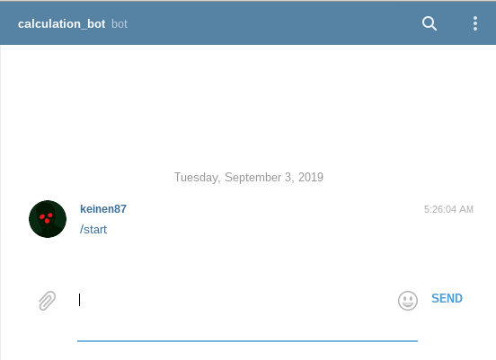

# Таймер для чат-бота в Telegram

Таймер с прогресс-баром, визуально показывающий сколько осталось до момента Х.



### Как установить

Python3 должен быть уже установлен.
Затем используйте `pip` (или `pip3`, есть конфликт с Python2) для установки зависимостей:
```
pip install -r requirements.txt
```

Для работы программы необходимо получить персональный ключ для взаимодействия с API Telegram.

Выглядит примерно так: 000000000:AAHmrmPmKoXXXXXXXjM1UeWLIppgzIUKXXX

Получить токен нужно в Телеграме у [Отца ботов](https://telegram.me/BotFather)

Полученный токен нужно прописать в файле `.env`

### Цель проекта

Код написан в образовательных целях на онлайн-курсе для веб-разработчиков [dvmn.org](https://dvmn.org/).
